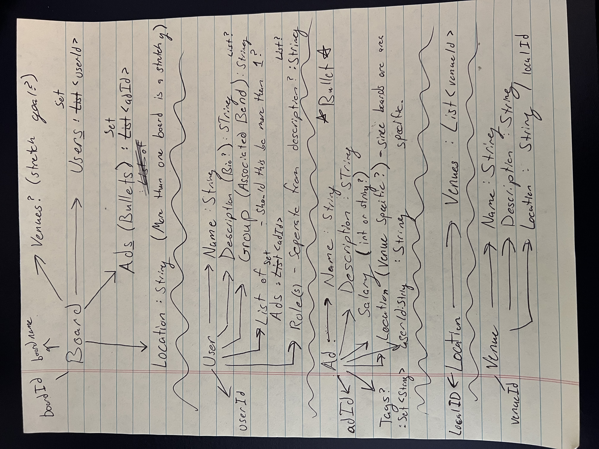
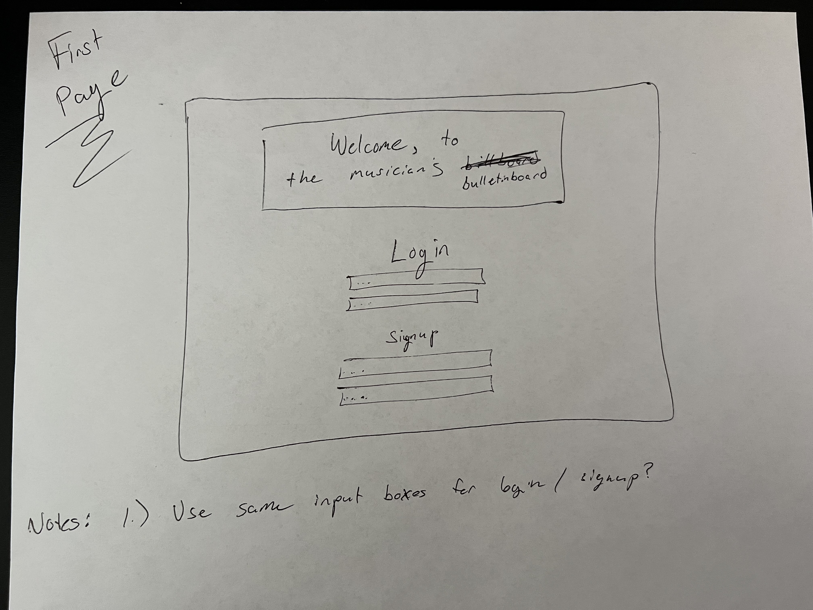
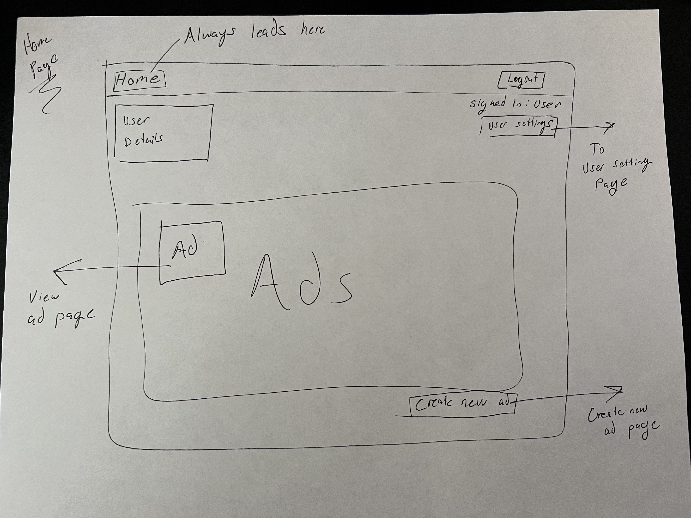
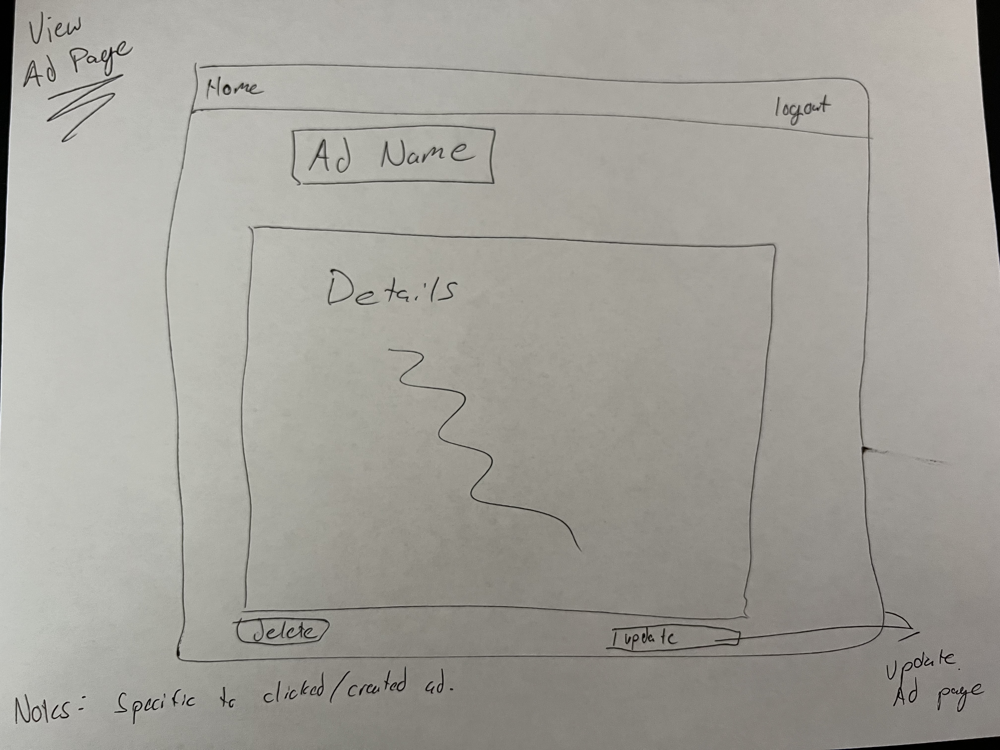
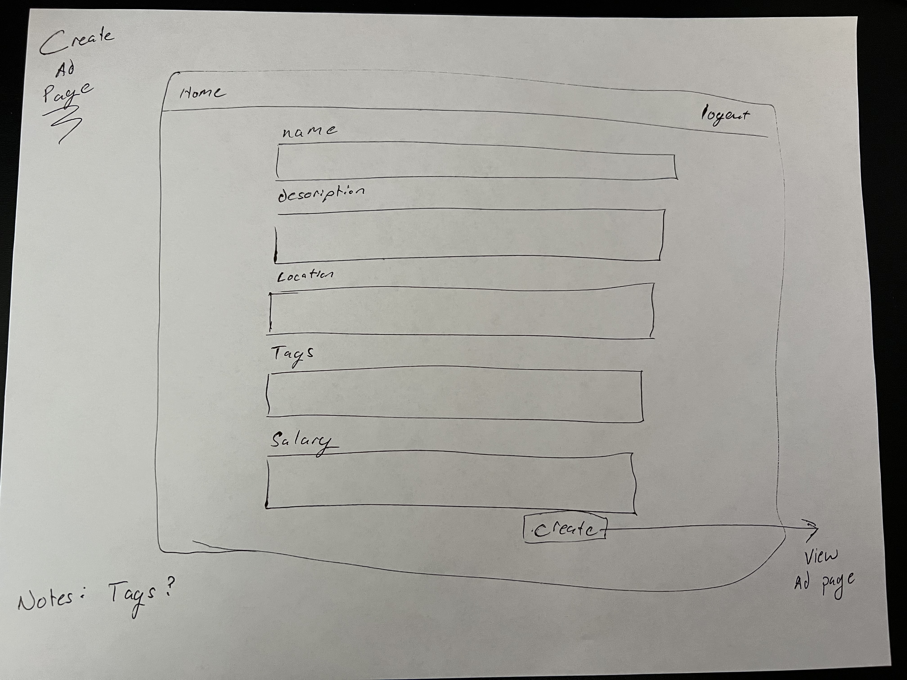
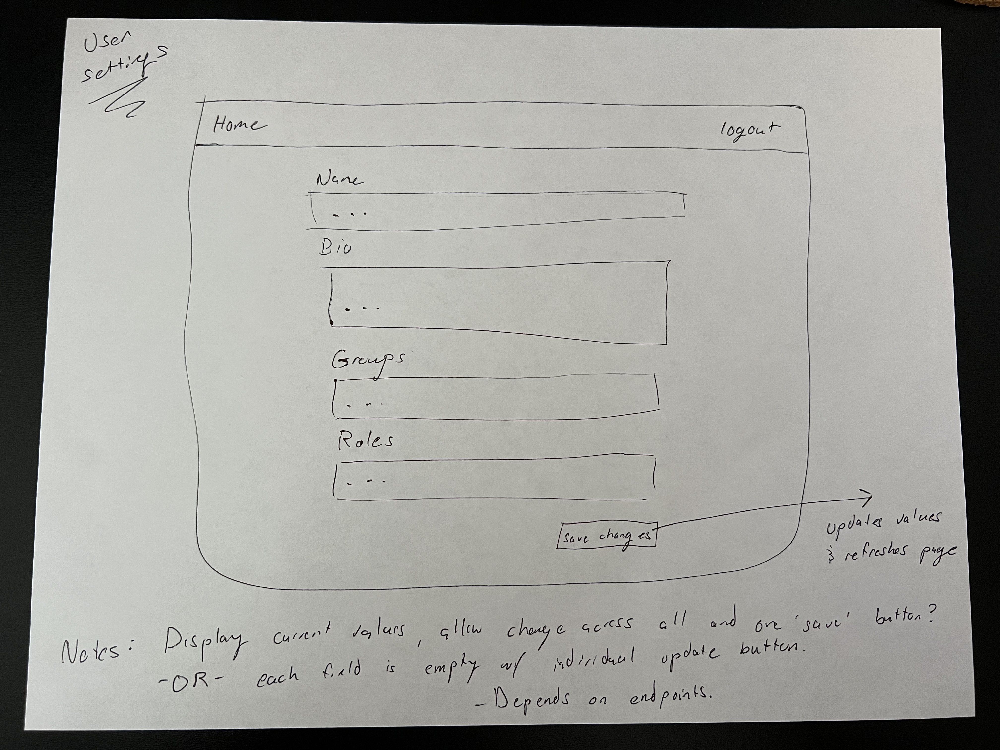

# Project Design Doc - Music Bulletin Board Design

## 1. Problem Statement

The Music Bulletin Board is a service allowing musicians to connect with their peers, within similar areas, to find work and post their needs. Users want to have the ability to detail out their 'want' ads with role needs, music genre expected, locations involved, as well as look at and respond to other user's posted ads. 

## 2. Top Questions to Resolve in Review
1.) How much depth should go into a user's posted ads? Name/description/role/date/salary?
    - should these be required?

2.) Will the application allow user's that are responding to posted ads to 'deep-dive' into the user posting the ad? - will that be more of a stretch goal and should this remain, at base level, an app for a user to simply post their ad.

3.) Should a filter/search system be put into place from the perspective of a user looking at ads?

4.) Should there be a separate login validation to determine if someone is looking or posting?
    - should there be a difference? Should there just be a separate page to allow a user to search through existing ads.

5.) Should an ad include tags?

6.) There is still a case to be debated on whether Locations and Venues should be a table rather than an attribute included with the other tables.


## 3. Use Cases

U1. As a user, I want to create a new ad.

U2. As a user, I want to view all my posted ad(s)

U3. As a user, I want to update my ad(s) details. 

U4. As a user, I want to be able to delete my ad(s).

U5. As a user, I want to be able to update my user profile details.

U6. As a user, I want to bb able to view my individual ad(s).

U7. As a user, I want to be able to update an ad (including name, description, location, tags, salary...).

U8. As a user, I want to be able to view my user details.

U9. As a user, I want to be able to

### 3.2  Stretch Use Cases

U1. As a user, I want to be able to view other user's ads.

U2. As a user, I want to be able to apply to another user's ad.

U3. As a user, I want to be able to filter through other user's ads.

U4. As a user, I want to be able to change bulletin boards.

U5. As a user, I want to view venues associated with a board.

## 4. Project Scope
### 4.1 In Scope

* Creating, retrieving, deleting, and updating an ad
* Retrieving all ads a user has created
* Updating a user's details. 

### 4.2 Out of Scope

* Multiple Boards (broader than Nashville area) - mid stretch
* Venues as an entity rather than a String - closest stretch?
* Allow users to apply to ads and view applications to their ads - farthest stretch 

## 5. Proposed Architecture Overview

The MLP will include creating, retrieving, and updating an ad. Included will also be the functionality to update a user's personal details.

API Gateway and Lambda will be used to create these endpoints to satisfy our requirements:
* `GetAd`
* `CreateAd`
* `UpdateAd`
* `DeleteAd`
* `GetUser`
* `CreateUser`
* `UpdateUser`

Boards, users, ads, locations and venues will be stored within DynamoDB in their own respective tables. 


## 6. API
### 6.1 Public Models
```
// UserModel

String userId;
String name;
String bio;
List<String> groups;
List<String> ads; //adId
```

```
// AdModel

String adId;
String name;
String description;
Double salary;
String location; //venue name
String userId;
Set<String> tags;
```

```
// LocationModel

String locationId;
String name;
List<String> venues; //venueId
```

```
// VenueModel

String venueId;
String name; 
String description;
String location;
```

```
// BoardModel

String boardId;
String name;
Set<String> users; //userIds
Set<String> ads; //adIds
String location;
```

### 6.2 Get Ad Endpoint
* Accepts `GET` requests to `/ads/:adId`
* Accepts an ad ID and returns the corresponding AdModel.
  * If the given ad ID is not found, will throw an `AdNotFoundException`

### 6.3 Create Ad Endpoint
* Accepts `POST` requests to `/ads`
* Accepts data to create a new ad with a provided name, a given userId, and an optional set of details. Returns the new ad, including a unique ad ID assigned by the service.
* For security concerns, we will validate the provided ad name does not contain any invalid characters: " ' \
  * If the playlist name contains any of the invalid characters, will throw an InvalidAttributeValueException.

### 6.4 Update Ad Endpoint
* Accepts `PUT` requests to `/ads/:adId`
* Accepts data to update an ad including an ad ID, any updated details, and the user ID associated with the ad. Returns the updated ad.
  * If the ad ID is not found, will throw an `AdNotFoundException`
* For security concerns, we will validate the provided ad name does not contain any invalid characters: " ' \
    * If the ad name contains any of the invalid characters, will throw an InvalidAttributeValueException.

### 6.5 Delete Ad Endpoint
* Accepts `DELETE` requests to `/ads/:adId`
* Accepts an adId and removes the corresponding ad from the database.
  * If the adID is not found, will throw an `AdNotFoundException`

### 6.6 Get User Endpoint
* Accepts `GET` requests to `/users/:userId`
* Accepts a user ID and returns the corresponding UserModel.
* If the given user ID is not found, will throw an `AdNotFoundException`

### 6.7 Create User Endpoint 
* Accepts `POST` requests to `/users`
* Accepts data to create a new user with a provided name and an email. Returns the new user, including a unique user ID assigned by the service. 
* For security concerns, we will validate the provided user's name does not contain any invalid characters: " ' \
    * If the name contains any of the invalid characters, will throw an InvalidAttributeValueException.

### 6.8 Update User Endpoint
* Accepts `PUT` requests to `/users/:userId`
* Accepts data to update a user's details including a user ID and any updated detail values. Returns the updated user.
  * If the user ID is not found, will throw a `UserNotFoundExcetpion`
* For security concerns, we will validate the provided user's name does not contain any invalid characters: " ' \
    * If the name contains any of the invalid characters, will throw an InvalidAttributeValueException.

## 7. Tables
### 7.1 `boards`
```
boardId // partition key, string
name // string
usersList // stringSet (userId)
adsList // stringSet (adId)
location // stringSet (locationId)
```

### 7.2 `ads`
```
Id // partition key, string
name // string
userId // string
tags // stringSet
```

### 7.3 `users`
```
userId // partition key, string
name // string
bio // string
group // stringList
adsList // stringSet (adId)
roles // stringList
```

### 7.4 `locations`
```
locationId // partition key, string
venuesList // stringSet (venueId)
```

### 7.5 `venues`
```
venueId // partition key, string
name // string
description // string
location // string (locationId)
```

## 8. Pages

### Mock overview of application entities


### Login Page (The initial page a user will see. Only appears at app load-up)
#### ----- Only page without a header
#### ----- All other pages will include a header with a 'logout' button, and either a 'Home' button or 'Home View' tag.


### Home Page
#### Includes a display of user details, a 'signed-in user' display with a button to adjust those details underneath, a display of all created ads, and a button to create a new ad. - 'Home' button will not be a functional button on this page, but tag of some sort to describe it as the home page.


### View Specific Ad Page


### Create Ad Page


### User Setting Page / Update user details


### Update Ad Page


